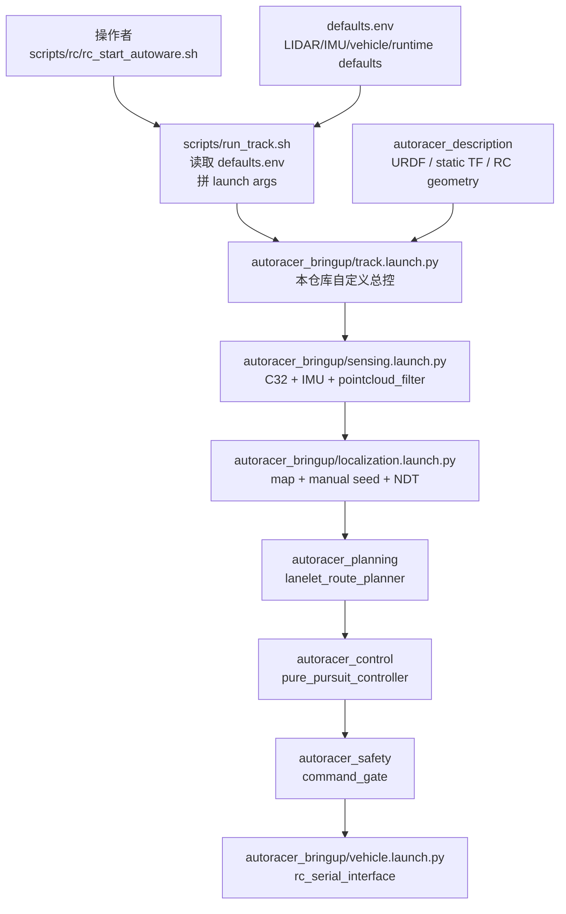
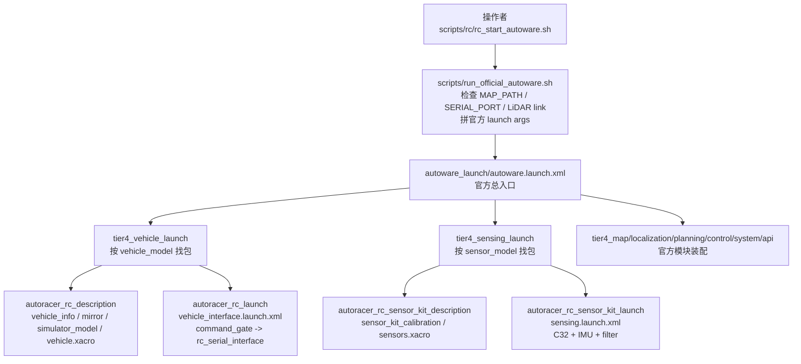

# 官方 Launch 结构迁移说明

用途：解释这次从本仓库自定义启动链路迁移到官方 Autoware 启动结构后，框架和配置位置发生了什么变化。非用途：不讨论是否替换 planning/control/gate 算法；算法迁移评估仍看 `official_migration_zh.md`。

## 一句话区别

旧结构是“本仓库自己当总控”：`autoracer_bringup/track.launch.py` 直接决定要启动哪些模块，并把 RC 的传感器、定位、规划、控制、安全门、串口车辆接口串起来。

新结构是“官方 Autoware 当总控”：`autoware_launch/autoware.launch.xml` 负责总装配；本仓库按官方约定提供 `autoracer_rc` 车辆包和 `autoracer_rc_sensor_kit` 传感器包，让官方 launch 按名字找到 RC 的配置和适配层。

这不是简单把几个参数换个文件名，而是启动责任边界变了：

| 维度 | 旧结构 | 官方结构 |
| --- | --- | --- |
| 总入口 | `scripts/run_track.sh` -> `autoracer_bringup/track.launch.py` | `scripts/run_official_autoware.sh` -> `autoware_launch/autoware.launch.xml` |
| 模块装配 | 本仓库 launch 手动 include sensing/localization/planning/control/safety/vehicle | 官方 launch include `tier4_*_launch`，再按 profile 名找 vehicle/sensor 包 |
| RC 车辆参数 | 分散在 `defaults.env`、`track.launch.py` 参数、`autoracer_description` | `autoracer_rc_description/config/vehicle_info.param.yaml` 等官方 profile 位置 |
| RC 传感器外参 | 旧 RC description / extrinsics 文件 | `autoracer_rc_sensor_kit_description/config/sensor_kit_calibration.yaml` |
| RC 传感器启动 | `autoracer_bringup/launch/sensing.launch.py` 手动启动 C32/IMU/filter | `autoracer_rc_sensor_kit_launch/launch/sensing.launch.xml`，由官方 `tier4_sensing_launch` 调用 |
| RC 车辆接口 | `autoracer_bringup/launch/vehicle.launch.py` 直接启动 `rc_serial_interface` | `autoracer_rc_launch/launch/vehicle_interface.launch.xml`，由官方 `tier4_vehicle_launch` 调用 |
| 安全门 | 本仓库 `track.launch.py` 中单独 include safety | RC vehicle profile 内仍保留 `command_gate`，放在官方车辆接口前 |
| 回退方式 | 主路径就是旧链路 | 本分支不保留兼容入口；需要回退时切回旧分支 |

## 旧结构图

旧结构里，仓库自己的 `track.launch.py` 是“大脑”。脚本先把大量环境变量翻译成 launch 参数，然后 `track.launch.py` 逐个 include 本仓库里的模块。



这个结构的优点是直观、快、好改；缺点是越往后越容易变成本仓库自己的“平行 Autoware launcher”。比如某个参数到底属于车辆 profile、sensor kit、定位模块，还是现场脚本，边界会越来越模糊。

## 官方结构图

官方结构里，顶层由 `autoware_launch` 接管。它不会直接知道 RC 车长什么样，而是通过 `vehicle_model` 和 `sensor_model` 两个名字去找符合约定的包。



这里最关键的是：本仓库不再自己定义“全车启动框架”，而是提供官方框架需要的 vehicle profile 和 sensor kit profile。

## 官方命名约定

当前 pin 的 `autoware_launch 0.50.0` 使用 `vehicle_model` 和 `sensor_model` 参数。给它：

```bash
vehicle_model:=autoracer_rc
sensor_model:=autoracer_rc_sensor_kit
```

官方 launch 会按下面规则找包：

| 官方参数 | 自动寻找的包 | 本仓库新增包 | 负责内容 |
| --- | --- | --- | --- |
| `vehicle_model:=autoracer_rc` | `$(vehicle_model)_description` | `autoracer_rc_description` | 车辆尺寸、几何、vehicle URDF、mirror/simulator 参数 |
| `vehicle_model:=autoracer_rc` | `$(vehicle_model)_launch` | `autoracer_rc_launch` | 车辆接口启动：安全门、RC 串口 adapter |
| `sensor_model:=autoracer_rc_sensor_kit` | `$(sensor_model)_description` | `autoracer_rc_sensor_kit_description` | 传感器外参、sensor kit URDF |
| `sensor_model:=autoracer_rc_sensor_kit` | `$(sensor_model)_launch` | `autoracer_rc_sensor_kit_launch` | C32、Hipnuc IMU、Madgwick、点云降采样 |

所以不是“把配置硬塞进官方文件”，而是把 RC 平台事实放到官方预期的位置。

同一仓库可以维护多套车型 profile，但每套 profile 必须用自己的 vehicle/sensor 名称，不能把 RC 配置继续放在 Hooke 名字下面：

| 平台 | `vehicle_model` | `sensor_model` | 当前状态 |
| --- | --- | --- | --- |
| RC Ackermann | `autoracer_rc` | `autoracer_rc_sensor_kit` | 当前已落地并作为 Orin 运行默认值 |
| Hooke | `autoracer_hooke` | `autoracer_hooke_sensor_kit` | 预留给真实 Hooke vehicle/sensor profile；迁移时必须填真实尺寸、外参、Hesai/Fixposition/Hooke CAN 配置 |

这意味着未来增加 Hooke official profile 时，应新增 `autoracer_hooke_description`、`autoracer_hooke_launch`、`autoracer_hooke_sensor_kit_description`、`autoracer_hooke_sensor_kit_launch`，而不是复用或改名 RC profile。

## 模板分层

本分支的目标不是保留一套能跑的临时工程，而是形成一个可以迁移车型、替换传感器、替换算法的官方结构模板：

```text
src/external/autoware/          官方依赖，固定版本，必要 patch 必须显式记录。
src/autoracer_rc_*              当前 RC/Orin 的 official vehicle/sensor profile。
src/autoracer_hooke_*           未来真实 Hooke official profile 的保留命名；未迁移前不要创建空壳默认入口。
src/autoracer_vehicle_interface 底盘 adapter：RC UART；未来 Hooke CAN adapter 应按同一边界接入。
src/autoracer_sensing           小型传感器 adapter，例如点云降采样和格式桥接。
src/autoracer_safety            底盘 adapter 前的安全门和限幅边界。
src/autoracer_localization      定位辅助 adapter，必须保持官方 topic/message/frame 契约。
src/autoracer_planning          自研 planning 候选；不能作为隐藏总控或旧链路入口。
src/autoracer_control           自研 control 候选；不能作为隐藏总控或旧链路入口。
scripts/rc/                     操作者入口，只做薄封装、检查和运行时参数传递。
docs/                           当前结构、操作流程、接口事实和迁移记录。
```

替换算法时优先遵守三个规则：

- 能用官方模块就启用官方模块，不复制一份本地并行实现。
- 自研模块必须像 Autoware 模块一样暴露清楚的 package、launch、参数、topic、diagnostics 契约。
- 不在 `src/external/autoware` 里做隐形魔改；需要 patch 时用独立提交说明来源、约束和验证。

## 配置是不是从写死变成官方位置

粗略这么理解是对的，但要更精确一点：

- 旧链路不是所有东西都写死在某个函数里；很多已经通过 `defaults.env`、launch arguments、YAML 参数文件传入。
- 真正的问题是：这些配置由本仓库自定义总控 `track.launch.py` 统一拼装，结构上不完全贴合官方 vehicle/sensor profile 约定。
- 新链路把“平台事实”移动到官方能发现的 profile 包里，脚本只传运行时变量，例如地图路径、是否开 RViz、是否开车辆接口、串口设备名。

可以理解成从“本仓库总控 + 参数散落”变成“官方总控 + 平台 profile 包”。

## 安全边界

官方结构不等于直接绕过安全门。RC 路径仍然保留：

```text
/control/command/control_cmd
  -> autoracer_safety/command_gate
  -> /autoracer/control/safe_control_cmd
  -> autoracer_vehicle_interface/rc_serial_interface
  -> UART
```

默认 `ENABLE_DRIVE_COMMANDS=false`。真实上车时还必须显式设置 `SERIAL_PORT=/dev/<actual_chassis_tty>`；否则官方 wrapper 会拒绝启动车辆接口，避免和 IMU 默认串口混用。

## 当前迁移状态

已完成：

- 官方 `autoware_launch` pin 已加入 `autoracer.repos`。
- RC vehicle profile 和 sensor kit profile 已建立。
- `tier4_vehicle_launch` 和 `tier4_sensing_launch` 能解析并找到对应 profile。
- `scripts/rc/rc_start_autoware.sh` 已切到官方 wrapper。
- 旧链路已从本分支移除：不再保留 `scripts/run_track.sh`、`autoracer_bringup` 包或旧 track launch 作为正式入口。
- 传感器录包和 localization-only helper 已改为通过 official wrapper/profile 启动。
- `rc_autoware.rviz` 作为当前 profile 的调试视图，归属到 `autoracer_rc_launch/rviz/`。
- Orin 上的最小 official runtime 闭包已完成构建，并通过无雷达/无底盘 60 秒启动 smoke。

仍需实车验证：

- 雷达和底盘上电后的完整 sensing -> localization -> planning -> control -> vehicle 闭环。
- 初始位姿、目标点、路线生成和控制输出在真实地图上的动态行为。
- Future Hooke vehicle/sensor profile 仍需按同一官方结构建立，不能恢复旧 bringup 总控。

## 以后怎么判断应该改哪里

| 要改的问题 | 优先位置 |
| --- | --- |
| 车身尺寸、轴距、最大转角 | `autoracer_rc_description/config/vehicle_info.param.yaml` |
| LiDAR/IMU 相对 `base_link` 的外参 | `autoracer_rc_sensor_kit_description/config/sensor_kit_calibration.yaml` |
| C32 驱动参数、盲区、距离裁剪、输出 frame/topic | `autoracer_rc_sensor_kit_launch/config/lslidar_cx.yaml` |
| IMU 串口、滤波输出、点云降采样 | `autoracer_rc_sensor_kit_launch/launch/sensing.launch.xml` 或其 config |
| RC 串口车辆接口、安全门与真实底盘串口 | `autoracer_rc_launch/launch/vehicle_interface.launch.xml` |
| 地图路径、是否开 RViz、是否开车辆接口 | `scripts/run_official_autoware.sh` 的运行时环境变量 |
| 本地临时调试 | 使用 official wrapper 的裁剪参数，或切回旧分支排查历史链路 |

原则：能放在 vehicle/sensor profile 的，不放回顶层脚本；只和现场运行有关的，不写死进 profile。
