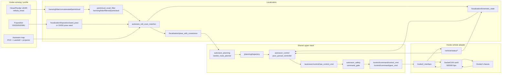
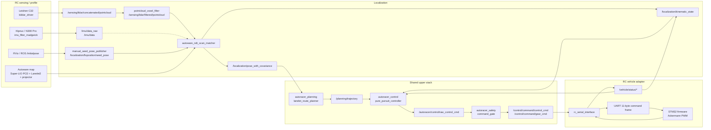

# RC 与 Hooke 平台/上层链路边界

用途：定义 Hooke `main` 和 RC 分支必须共享的 upper stack 契约，以及允许因平台不同而变化的适配层。非用途：不写现场启动命令，不记录一次性测试过程。

静态预览图：`docs/architecture/image.png`。该图片用于汇报和快速浏览；本文中的 Mermaid 图和 `runtime_alignment_audit_zh.md` 是可维护源码和事实依据。修改架构图时必须同步更新 Mermaid、审计表和静态预览图。

## 核心原则

RC 不是新自动驾驶栈。RC 是 Hooke `main` 共享 upper stack 的缩比验证平台。

当前目标：

- 保持 Hooke/RC 共享 `localization -> planning -> control -> gate`。
- 在 RC 上跑通这套 upper stack，验证接口、消息字段、时序和控制行为。
- 传感器、初始位姿来源、车辆参数、外参、vehicle adapter 按平台配置。
- 是否迁移官方 Autoware planning/control/gate，等 RC 实测后再作为 Hooke/RC 共同任务评估。

## 必须一致

| 领域 | 约束 |
| --- | --- |
| Autoware 依赖 | 使用同一组 `autoracer.repos` pin，不给 RC 单独混拉版本。 |
| 地图契约 | `pointcloud_map.pcd`、`pointcloud_map_metadata.yaml`、`lanelet2_map.osm`、`map_projector_info.yaml`。 |
| 定位主链路 | 点云地图 + NDT + seed pose；RC 不退回 AMCL/slam_toolbox。 |
| Upper stack | Hooke/RC 使用同一套 planning/control/gate。 |
| Topic 语义 | `/sensing/*`、`/localization/*`、`/planning/*`、`/control/command/*`、`/vehicle/status/*` 的消息类型、单位、字段含义一致。 |
| 车辆模型 | Ackermann 运动学、前轮转角、纵向速度、gear/control mode 语义一致。 |

## 允许不同

| 层 | Hooke | RC | 约束 |
| --- | --- | --- | --- |
| LiDAR | Hesai/Pandar + Nebula | Leishen C32 + `lslidar_driver` | 输出同一 Autoware 点云 topic。 |
| Seed/INS | Fixposition | RViz `/initialpose`、Hipnuc IMU | 只替换 seed 来源，不替换 NDT。 |
| Vehicle adapter | CAN + `hooke2_interface` | UART + `rc_serial_interface` | 差异停留在 adapter 内。 |
| Vehicle profile | Hooke 尺寸/外参 | RC 尺寸/外参 | 参数整体切换，不局部漂移。 |
| Runtime host | 真车车载计算平台 | 当前临时 ARM 主机，后续 Orin | 主机不是架构边界。 |

## Hooke 底盘架构图

## RC 底盘架构图

两张图的中间 `Shared upper stack` 必须保持一致。RC 与 Hooke 的差异只允许出现在 sensing/profile、seed 来源、vehicle profile、map asset 生产流程和 vehicle adapter。

## 当前共享模块

| 模块 | 当前实现 | 保留原因 |
| --- | --- | --- |
| Planning | `autoracer_planning/lanelet_route_planner.py` | Hooke/RC 共享当前 planner；先验证能否跨平台工作。 |
| Control | `autoracer_control/pure_pursuit_controller.py` | Hooke/RC 共享当前 controller；RC 只调整车辆参数和底盘反馈。 |
| Gate | `autoracer_safety/command_gate.py` | Hooke/RC 共享当前 gate；RC 不单独替换安全语义。 |

## 灰区规则

- `/localization/kinematic_state` 当前是过渡状态输出；必须满足 Autoware frame、单位、速度语义。
- `autoracer_planning`、`autoracer_control`、`autoracer_safety` 是共享 upper stack，不是 RC 专用包。
- C32 点云字段不兼容时做字段适配，不改定位算法。
- STM32 deadband、PWM、最小输出速度属于 adapter/firmware 事实，不反推上层算法。
- 现场 IP、账号、密码、本机串口名不进仓库。

## 禁止事项

- 不把 Nav2 的 AMCL、slam_toolbox、`/scan`、`/wheel_odom`、`/chassis_state`、`/ackermann_cmd` 接进 upper stack。
- 不因为 RC 没有 Fixposition/ZED 就替换地图定位算法。
- 不在 RC 分支单独 fork planning/control/gate。
- 不围绕 STM32 deadband、PWM 或 UART 细节改上层算法。
- 不只改 final gate 来掩盖 trajectory、control、gear、adapter 任一层的问题。

## Autoware 版本规则

- 默认使用当前 Hooke 已 pin 的 `autoracer.repos`。
- 新增官方包必须来自同一组 pin。
- 升级 Autoware 是单独迁移任务，必须同时验证 Hooke profile 和 RC profile。
- x86 开发机只做脚本、建图、静态检查和部分构建；完整 runtime 以 ARM 车端为准。

## 验收顺序

1. Sensing/TF：点云、IMU、静态 TF、车辆状态 topic 可用。
2. Localization：地图加载、manual seed、NDT pose、`kinematic_state` 可用。
3. Planning：RViz goal 后生成 `/planning/trajectory`。
4. Control：raw control 命令方向、速度、转角合理。
5. Gate：禁用时输出 stop，使能后输出 gated command 和 gear command。
6. Vehicle adapter：串口/CAN 命令和反馈符号、单位、频率正确。
7. Low-speed drive：低速闭环验证，形成 bag/log 和问题清单。
