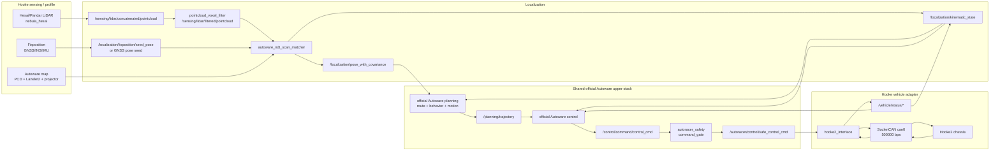
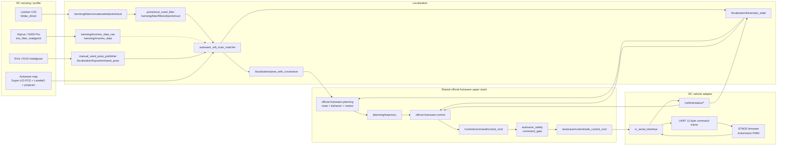

# RC/Hooke 系统架构说明

用途：说明 RC/Hooke 在官方 Autoware profile 框架下的运行时系统架构，包括 profile 装配、node/topic/frame 数据流、控制边界和验证顺序。非用途：不解释仓库目录结构，不记录一次性排查日志，不保存过渡计划。项目结构和“应该改哪里”以 `README.md` 为准。

## 平台原则

RC 不是一套新的自动驾驶栈。RC 是 Hooke/Autoware upper stack 的缩比验证平台，用来先验证 localization、official Autoware planning/control、gate 和 adapter 边界，再迁移到真实 Hooke 底盘。

长期边界：

- Hooke 和 RC 共享 official Autoware planning/control、地图、定位 topic、控制 topic 和 vehicle status 语义。
- CAN 与串口差异停留在 chassis/transport adapter 内；Hooke 用 CAN，RC 用 serial。
- 车辆尺寸、传感器外参、驱动参数、底盘 adapter 放在对应 vehicle/sensor profile 和 adapter 包里。
- 自研 planning/control 候选可以保留，但只能显式替换官方接口，不作为隐藏默认链路。
- `src/external/autoware` 是 pinned upstream 依赖；不在 `src/external/autoware` 里做隐形修改。

## 官方 Launch 结构

当前启动总控是官方 `autoware_launch/autoware.launch.xml`。本仓库按官方约定提供 vehicle profile 和 sensor-kit profile：

```bash
ros2 launch autoware_launch autoware.launch.xml \
  vehicle_model:=autoracer_rc \
  sensor_model:=autoracer_rc_sensor_kit
```

官方 launch 会按名字寻找这些包：

| 参数 | 官方查找规则 | 当前 RC 包 | 责任 |
| --- | --- | --- | --- |
| `vehicle_model:=autoracer_rc` | `$(vehicle_model)_description` | `autoracer_rc_description` | 车辆尺寸、vehicle info、vehicle xacro。 |
| `vehicle_model:=autoracer_rc` | `$(vehicle_model)_launch` | `autoracer_rc_launch` | vehicle interface、safety gate、RViz profile。 |
| `sensor_model:=autoracer_rc_sensor_kit` | `$(sensor_model)_description` | `autoracer_rc_sensor_kit_description` | sensor kit xacro、LiDAR/IMU 外参。 |
| `sensor_model:=autoracer_rc_sensor_kit` | `$(sensor_model)_launch` | `autoracer_rc_sensor_kit_launch` | C32、Hipnuc IMU、Madgwick、pointcloud filter。 |

`scripts/rc/` 是操作者入口，只做薄封装、检查和运行时参数传递。`scripts/common/` 只能放不依赖具体车辆硬件事实的 helper。`scripts/hooke/` 在 Hooke profile 完成前只能 fail-fast。

## Profile 状态

| 平台 | `vehicle_model` | `sensor_model` | 状态 | 源码位置 | 脚本入口 | 当前责任 |
| --- | --- | --- | --- | --- | --- | --- |
| RC Ackermann | `autoracer_rc` | `autoracer_rc_sensor_kit` | active runtime baseline | `src/autoracer_rc_*` | `scripts/rc/` | 当前唯一可运行开发基线，继续用于 Orin 上的 RC 实车验证。 |
| Hooke | `autoracer_hooke` | `autoracer_hooke_sensor_kit` | `disabled_placeholder` / not runtime ready | `src/autoracer_hooke_*` | `scripts/hooke/` | 交给 Hooke 负责人补真实 vehicle、sensor、CAN adapter、sensing launch。 |

Hooke official profile 当前只保留占位目录。每个 `src/autoracer_hooke_*` 目录都必须保留 `COLCON_IGNORE`，直到真实 Hooke 配置完成。占位目录没有 `package.xml`，目的就是避免 `colcon`、`autoware_launch` 或操作者误认为 Hooke 已经可运行。

Hooke 负责人可以参考 vendored Hooke reference：

```text
src/hooke2_vehicle
src/hardware_drivers
src/wd_msgs
```

但不要让 RC wrapper 指向这些 reference package，也不要用 RC 参数伪装 Hooke profile 通过。

## Nodeviewer/Dataflow 图

离线 nodeviewer 风格图放在：

```text
docs/architecture/rc_official_runtime_graph.mmd
```

这张图描述运行时 node/topic/dataflow 关系，不是上车 HMI，也不是仓库目录结构说明。当前 `.mmd` 是人工维护的 Mermaid 源图，所以不放在 `generated/`。如果后续接入 nodeviewer 或 ROS graph 导出器，生成出来的 HTML/Mermaid/JSON 应该有可复现的生成命令，并和人工维护的源图分开命名。

## Hooke 底盘架构图



## RC 底盘架构图



两张图的中间 `Shared official Autoware upper stack` 必须保持一致。RC 与 Hooke 的差异只允许出现在 sensing/profile、seed 来源、vehicle profile、map asset 生产流程和 vehicle adapter。

## 算法替换边界

当前默认上层链路是 official Autoware planning/control。以下本地包只作为自研 planning/control 候选存在：

```text
src/autoracer_planning
src/autoracer_control
```

启用自研候选的条件：

- 输入输出 topic、message、frame、单位遵守 official Autoware contract。
- 在 launch/profile 层显式替换，不通过脚本暗中切换。
- 保留 `autoracer_safety` gate 和 vehicle adapter 的清晰边界。
- Hooke/RC 共同维护接口，不给 RC 单独分叉 upper stack。

## 验收顺序

1. Sensing/TF：点云、IMU、静态 TF、车辆状态 topic 可用。
2. Localization：地图加载、manual seed、NDT pose、`kinematic_state` 可用。
3. Planning：官方 planning route/goal 后生成 `/planning/trajectory`。
4. Control：官方 control 输出 `/control/command/control_cmd`，方向、速度、转角合理。
5. Gate：禁用时输出 stop，使能后输出 `/autoracer/control/safe_control_cmd` 和必要 support command。
6. Vehicle adapter：串口/CAN 命令和反馈符号、单位、频率正确。
7. Low-speed drive：低速闭环验证，形成 bag/log 和问题清单。
